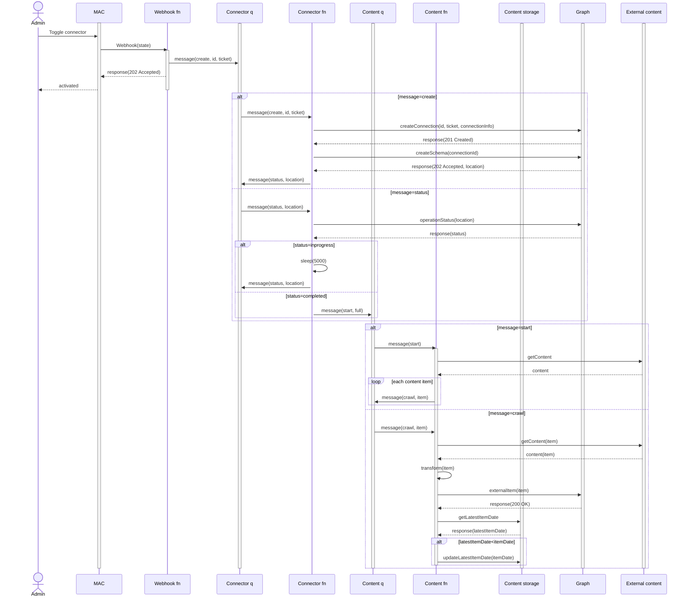
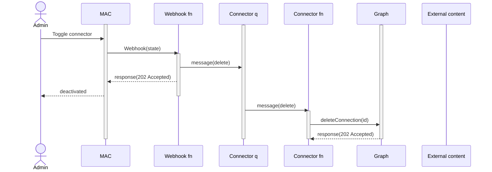

# GitHub Microsoft Graph connector

Sample project that uses Teams Toolkit to simplify the process of creating a [Microsoft Graph connector](https://learn.microsoft.com/graph/connecting-external-content-connectors-overview) that pushes data from GitHub to Microsoft Graph and includes the [simplified admin experience](https://learn.microsoft.com/graph/connecting-external-content-deploy-teams).

## Prerequisities

 - [Azure Function Core Tools v4](https://learn.microsoft.com/azure/azure-functions/functions-run-local)
 - Teams Toolkit for Visual Studio Code
 - Microsoft 365 tenant with [uploading custom apps enabled](https://learn.microsoft.com/microsoftteams/platform/m365-apps/prerequisites#prepare-a-developer-tenant-for-testing)

 ## Get started

 - Clone repo
 - Open in VSCode
 - Press `F5`

## Architecture

### Activating connector

### Deactivating connector

### Incremental crawl

### On-demand crawl

## Test function

 - Go to `Start local tunnel` terminal window to discover forwarding URL e.g. `https://<tunnelid>-7071.<region>.devtunnels.ms`
 - `curl https://<tunnelid>-7071.<region>.devtunnels.ms/api/notification`

### Queue

 - Open Microsoft Azure Storage Explorer
 - Expand `Emulated & Attached` > `Emulator Default Ports` > `Queues`
 - Create new queue called `queue-items`
 - Create message in queue