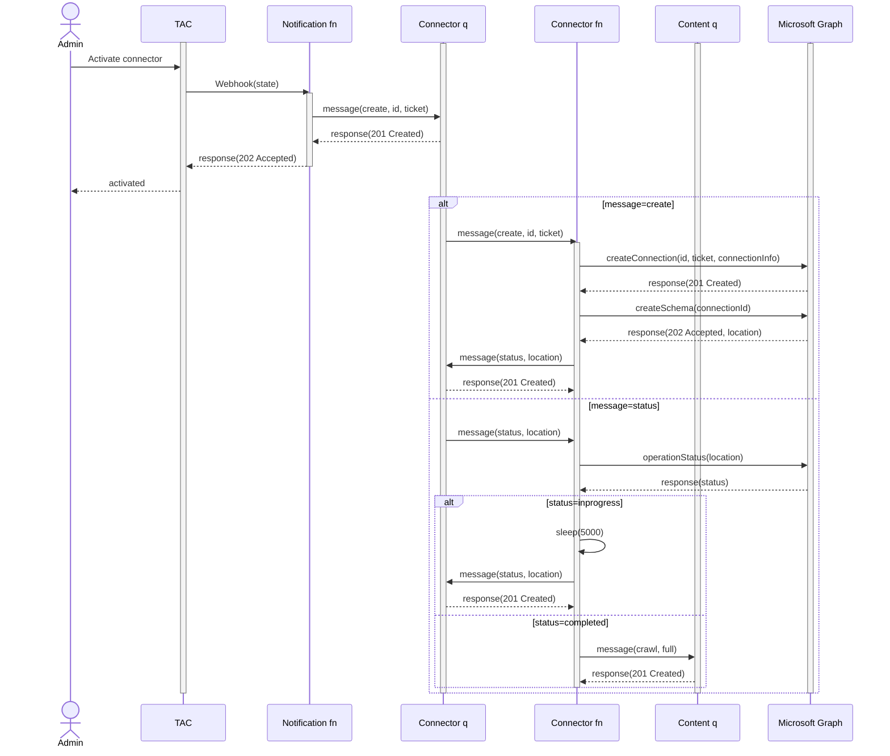
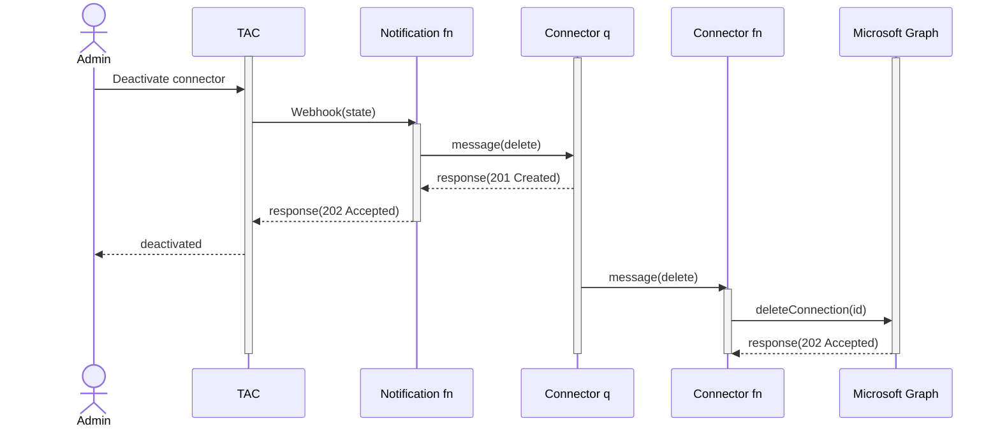
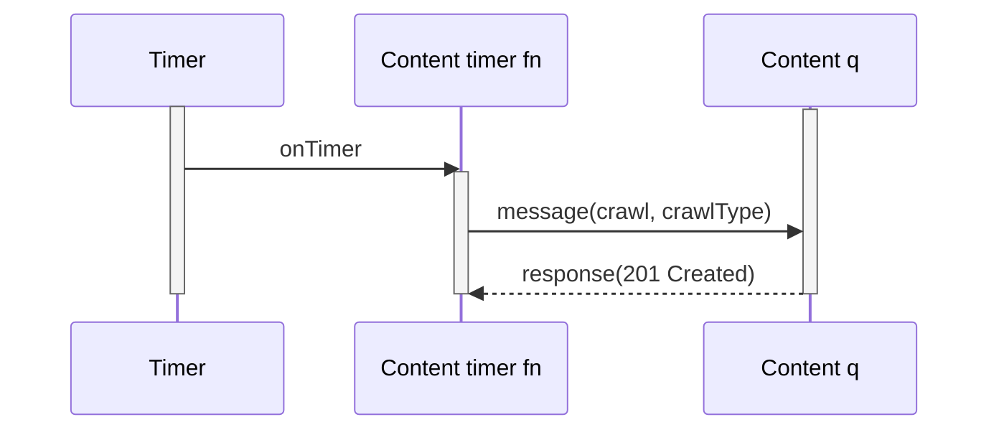
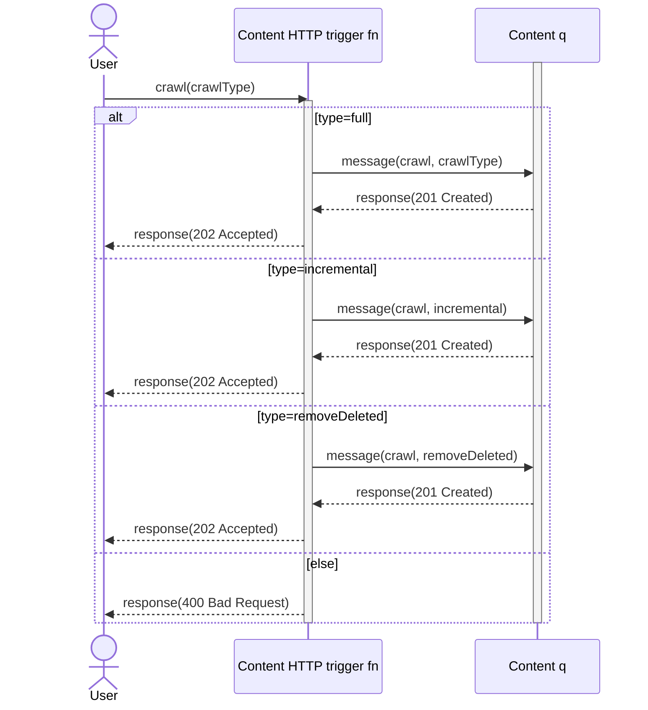
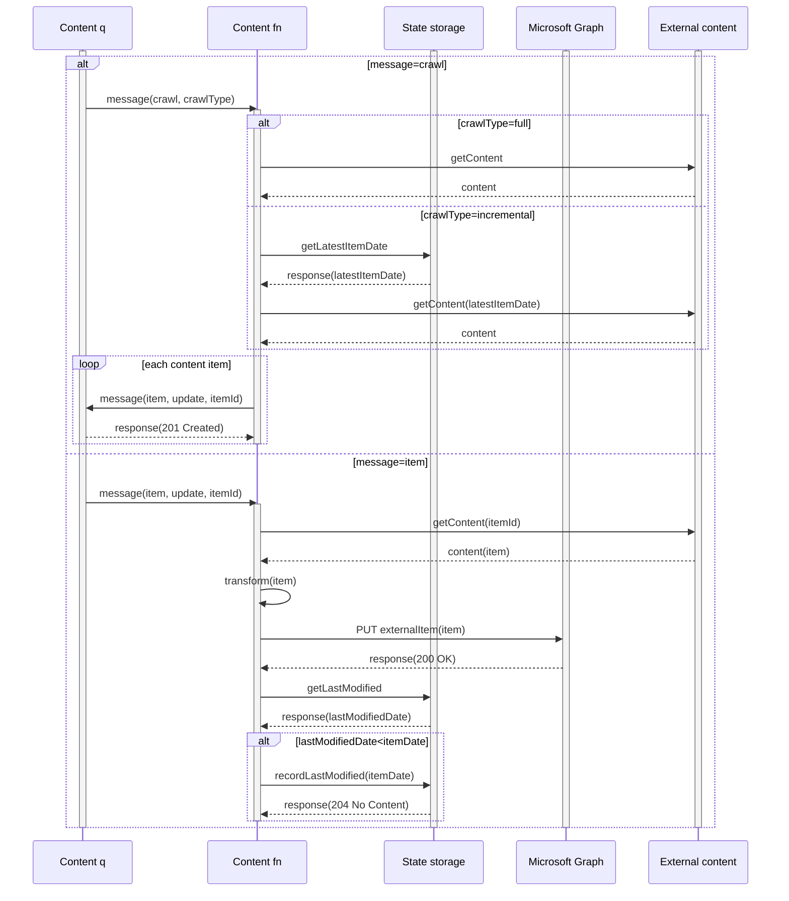
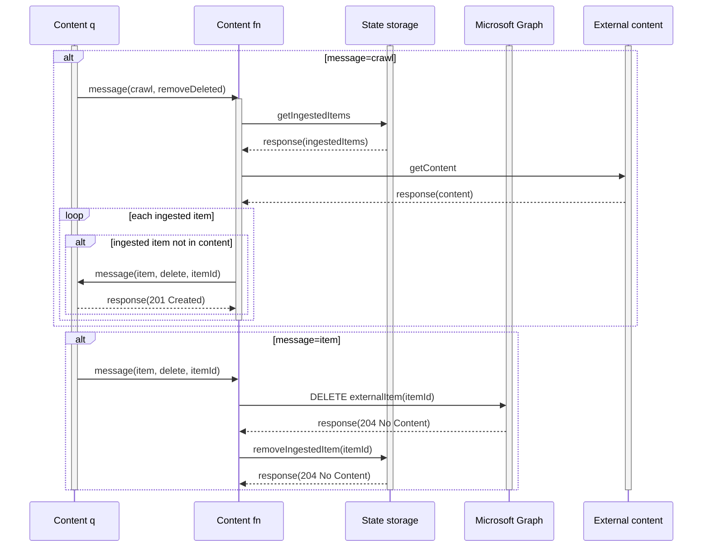

# Food Catalog Microsoft Graph connector

Sample project that uses Teams Toolkit to simplify the process of creating a [Microsoft Graph connector](https://learn.microsoft.com/graph/connecting-external-content-connectors-overview) that pushes data from a custom API to Microsoft Graph and includes the [simplified admin experience](https://learn.microsoft.com/graph/connecting-external-content-deploy-teams).

Sample data is taken from [Open Food Facts API](https://openfoodfacts.github.io/openfoodfacts-server/api/).

## Prerequisites

- [Azure Function Core Tools v4](https://learn.microsoft.com/azure/azure-functions/functions-run-local)
- [Dev Tunnels CLI](https://learn.microsoft.com/azure/developer/dev-tunnels/get-started#install)
- Teams Toolkit for Visual Studio Code
- Microsoft 365 tenant with [uploading custom apps enabled](https://learn.microsoft.com/microsoftteams/platform/m365-apps/prerequisites#prepare-a-developer-tenant-for-testing)

## Get started

- Login to dev tunnels, `devtunnel user login`
- First run:
  - Create permanent dev tunnel, `devtunnel create`, take note of the tunnel id or name
  - Create dev tunnel port, `devtunnel port create <tunnel-id-or-name> -p 7071`
  - Open port, `devtunnel access create <tunnel-id-or-name> -p 7071 -a`
- Start tunnel, `devtunnel host <tunnel-id-or-name>`, take note of the tunnel URL shown in output
- Clone repo
- Open repo in VSCode
- Update `env/.env.local`
  - Set `NOTIFICATION_ENDPOINT` to the tunnel URL
  - Set `NOTIFICATION_DOMAIN` to the tunnel URL without `https://`
- Press `F5`

## Architecture

### Activating connector



### Deactivating connector



### Scheduled crawl

Scheduled crawl can be either incremental crawl or removing items deleted from the external source.



### On-demand crawl



### Crawl



### Removing deleted content



## Test function

- Go to `Start local tunnel` terminal window to discover forwarding URL e.g. `https://<tunnelid>-7071.<region>.devtunnels.ms`
- `curl https://<tunnelid>-7071.<region>.devtunnels.ms/api/notification`

### Products API

Get products

```http
GET /api/products
```

Get product

```http
GET /api/product/{id}
```

Create product

```http
POST api/products

{"product_name":"New product"}
```

Update product

```http
PATCH api/products/{id}

{"product_name":"Updated product name"}
```

Delete product

```http
DELETE api/products/{id}
```
